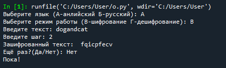
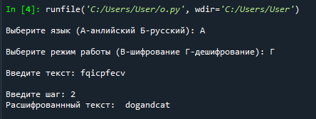
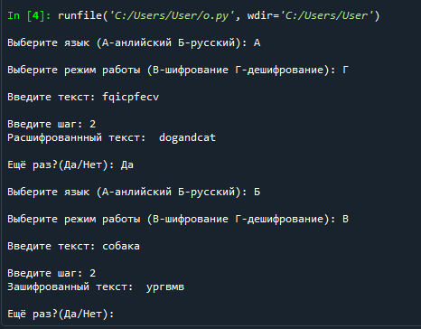
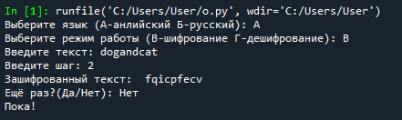

# Руководство пользователя программы

Назначение программы
 -----
Данная программа предназначена для шифрования и дешифрования строк шифром Цезаря.

Запуск программы
 -----
Программу следует запускать в среде, поддерживающей язык программирования Python. После запуска необходимо выбрать язык (английский/русский), а так же режим работы (шифрование/дешифрование). Далее требуется ввести шаг, с которым будет выполняться программа, и строку для шифрования/дешифрования.

Выполнение основных функций программы
-----
Далее будет представлена реализации возможности шифрования строки с шагом равным 2:

Далее будет представлена реализации возможности дешифрования строки с шагом равным 2:

Завершение программы
-----
После шифрования/дешифрования строки у пользователя есть возможность ещё раз воспользоваться функционалом программы или прекратить её использование.

Воспользоваться ещё раз:

Прекратить использование:

